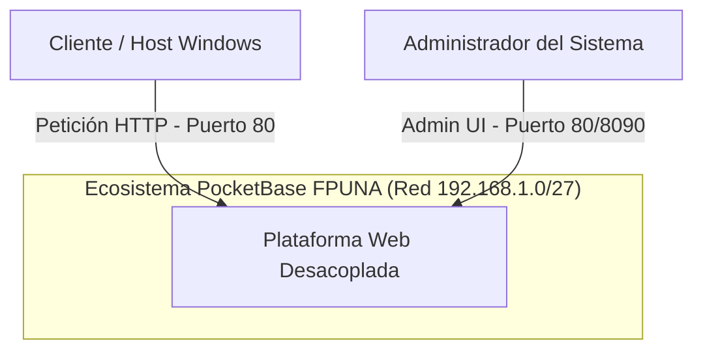

# C4 - Nivel 1: Diagrama de Contexto (F5-E5)

```mermaid
graph TD
    Client["Cliente / Host Windows"]
    Admin["Administrador del Sistema"]

    subgraph Boundary["Ecosistema PocketBase FPUNA (Red 192.168.1.0/27)"]
        App["Plataforma Web Desacoplada"]
    end

    Client -->|Petición HTTP - Puerto 80| App
    Admin -->|Admin UI - Puerto 80/8090| App
```
